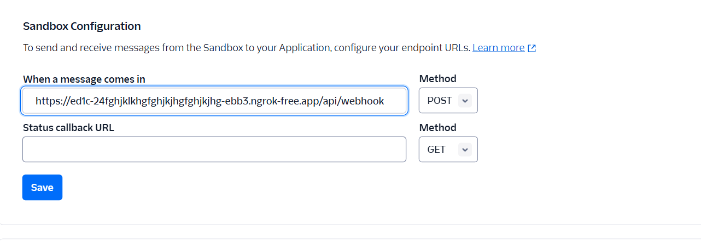
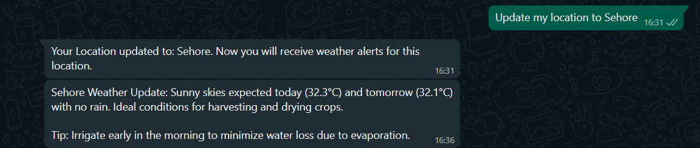
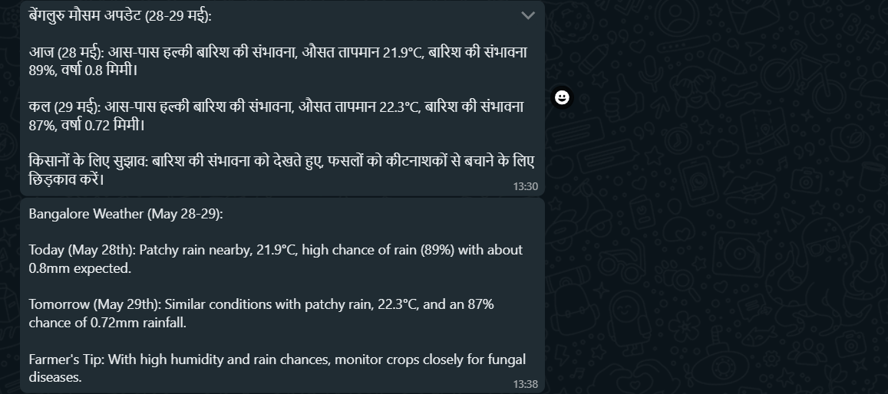

# AgriWeather Alert System 🌾☁️
<p align="center">
  
</p>


## 📌 Project Description

### 🎯 Problem Statement

Many farmers, especially in rural areas, are not comfortable using smartphones or typing queries online. However, they can read messages. They often rely on rumors or second-hand weather advice, which sometimes leads to uninformed crop decisions.

### ✅ Solution Overview

AgriWeather Alert System automates the delivery of weather updates via SMS and WhatsApp in Hindi and English, requiring no technical skills or interactions from the farmers. It runs scheduled weather checks twice a day and sends easy-to-understand messages.

### 🌟 Key Benefits

1. No need to search or browse online

2. Supports non-tech-savvy farmers

3. Returns weather updates according to the users preferred language.

4. Supports natural language processing 

5. Zero interaction required — just read the message

Reduces dependency on unreliable information sources
---

## 🛠️ Setup Instructions

1. Install **Java JDK 17** or higher.
2. Install **Maven 3.6** or higher.
3. Create accounts for the following services:
    - [Twilio](https://www.twilio.com/)
    - [Google Cloud AI Gemini](https://aistudio.google.com/)
    - Weather API provider (e.g., OpenWeatherMap)
4. Configure credentials in `src/main/resources/application.properties`:
   ```properties
   twilio.account.sid=...
   twilio.auth.token=...
   twilio.whatsapp.number=...
   gemini.api.key=...
   weather.api.key=...
   spring.datasource.url=...
   spring.datasource.username=...
   spring.datasource.password=...
   ```
5. Build the application:
   ```bash
   mvn clean install
   ```
6. Run the application:
   ```bash
   mvn spring-boot:run
   ```

> By default, the application runs on **http://localhost:8080**

---

## ▶️ Run the Project Locally

### 1. Clone the Repository

```bash
git clone https://github.com/your-username/agriweather-alert.git
cd agriweather-alert
```

### 2. Start the Application

```bash
mvn spring-boot:run
```

---

## 🌐 Expose Localhost using Ngrok

### 1. Install [Ngrok](https://ngrok.com/download)

### 2. Start a tunnel:

```bash
ngrok http 8080
```

Copy the HTTPS URL from the terminal output (e.g., `https://abcd1234.ngrok.io`).

---

## 💬 Configure Twilio Sandbox

1. Log in to the [Twilio Console](https://www.twilio.com/console).
2. Go to **Messaging > Try it Out > WhatsApp Sandbox**.
3. Set the **Webhook URL** to:

```
https://your-ngrok-url.ngrok.io/api/webhook
```

4. Join the sandbox by sending the join code (e.g., `join brave-owl`) to the provided WhatsApp number.



---

## 🕒 Scheduling (Optional)

To automatically send alerts twice a day, configure a cron job or use Spring’s `@Scheduled` annotation in your service class.

Example:

```java
@Scheduled(cron = "0 0 5,17 * * *") // 5:00 AM and 5:00 PM daily
public void sendWeatherAlerts() {
    // alert logic here
}
```

---

## 📱 User View

### 1. Update Location (via WhatsApp)



### 2. Automatically Scheduled Alerts

Alerts sent at **5:00 AM** daily.



---

## 📚 Memory Bank

The `memory-bank/` folder contains key documentation files:

- `projectbrief.md` – Summary of the project purpose
- `productContext.md` – Context of use
- `systemPatterns.md` – Architecture patterns
- `techContext.md` – Technical stack overview
- `activeContext.md` – Current working modules
- `progress.md` – Development progress and milestones

---

## 📩 Contact

For contributions, issues, or questions, feel free to open an issue or contact the maintainer.

---


## 📝 License 

This project is licensed under the [MIT License](LICENSE).

---