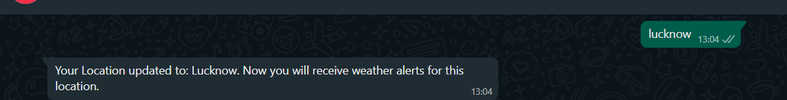
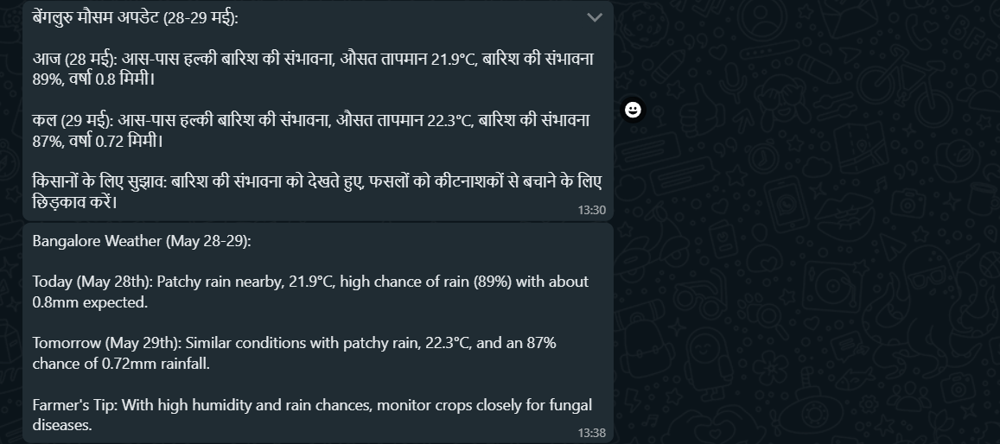

# AgriWeather Alert System

## Project Description

The AgriWeather Alert System provides farmers with timely and accurate weather information in Hindi and English via SMS/WhatsApp to help them make informed decisions about their crops. The system automatically sends weather alerts to farmers on a scheduled basis.

## Setup Instructions

1.  Install Java Development Kit (JDK) 17 or higher.
2.  Install Maven 3.6 or higher.
3.  Create a Twilio account.
4.  Create a Google Cloud AI Gemini account.
5.  Create an account with a weather API provider.
6.  Configure the application properties in `src/main/resources/application.properties` with your Twilio, Gemini, and weather API credentials.
7.  Build the application using Maven: `mvn clean install`
8.  Run the application: `mvn spring-boot:run`

## Usage Instructions

The system automatically sends weather alerts to farmers on a scheduled basis. To receive weather alerts, farmers need to register with the system and provide their location.

## Update Location 

### Scheduled Alerts Everyday at 5:00 AM

## Memory Bank

The memory bank contains the following files:

*   `projectbrief.md`
*   `productContext.md`
*   `systemPatterns.md`
*   `techContext.md`
*   `activeContext.md`
*   `progress.md`

These files contain information about the project, including the project goals, the problem it solves, the system architecture, the technologies used, the current work focus, and the project status.

## License

MIT License

Copyright (c) 2025 Sumit Verma

Permission is hereby granted, free of charge, to any person obtaining a copy
of this software and associated documentation files (the "Software"), to deal
in the Software without restriction, including without limitation the rights
to use, copy, modify, merge, publish, distribute, sublicense, and/or sell
copies of the Software, and to permit persons to whom the Software is
furnished to do so, subject to the following conditions:

The above copyright notice and this permission notice shall be included in all
copies or substantial portions of the Software.

THE SOFTWARE IS PROVIDED "AS IS", WITHOUT WARRANTY OF ANY KIND, EXPRESS OR
IMPLIED, INCLUDING BUT NOT LIMITED TO THE WARRANTIES OF MERCHANTABILITY,
FITNESS FOR A PARTICULAR PURPOSE AND NONINFRINGEMENT. IN NO EVENT SHALL THE
AUTHORS OR COPYRIGHT HOLDERS BE LIABLE FOR ANY CLAIM, DAMAGES OR OTHER
LIABILITY, WHETHER IN AN ACTION OF CONTRACT, TORT OR OTHERWISE, ARISING FROM,
OUT OF OR IN CONNECTION WITH THE SOFTWARE OR THE USE OR OTHER DEALINGS IN THE
SOFTWARE.
